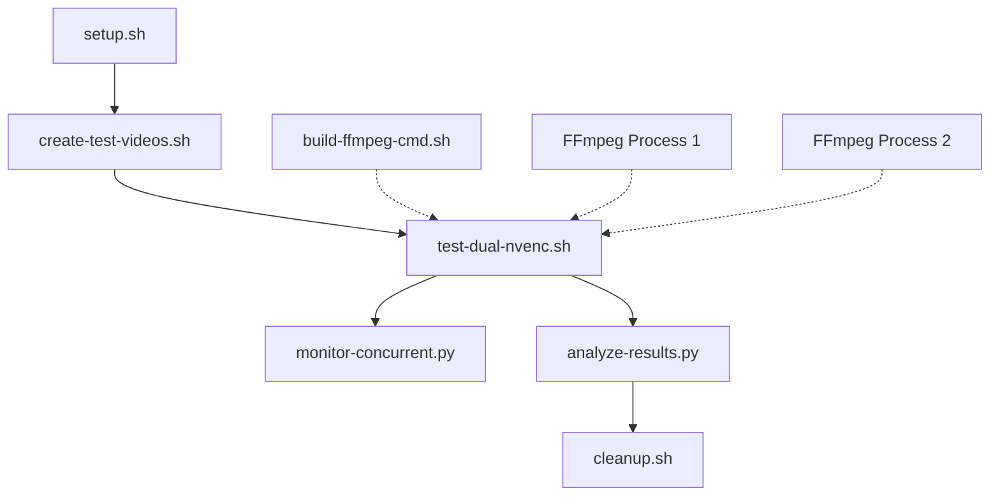

# RTX 4090 Dual-NVENC Concurrent Stream Test Suite

Complete test suite for evaluating RTX 4090's dual NVENC encoder capacity with concurrent stream processing.

## 🎯 Purpose

Test RTX 4090's capability to handle concurrent video streams using both NVENC encoders simultaneously:
- **Process-1**: 50 concurrent streams → NVENC #1
- **Process-2**: 50 concurrent streams → NVENC #2
- **Total**: 100 concurrent streams (1080p→720p@30fps)

## 📋 Test Specifications

### Input Configuration
- **Resolution**: 1920×1080 @ 30fps
- **Format**: MP4 (H.264)
- **Duration**: 120 seconds per video
- **Count**: Up to 200 test videos

### Output Configuration
- **Resolution**: 1280×720 @ 30fps
- **Bitrate**: 2 Mbps CBR
- **Format**: HLS (playlist.m3u8 + TS segments)
- **Codec**: H.264 NVENC
- **Segment Duration**: 6 seconds

### Memory Optimization
- **analyzeduration**: 10M
- **probesize**: 50M
- **bufsize**: 4M (VBV buffer)
- **thread_queue_size**: 512
- **max_muxing_queue_size**: 1024

## 🚀 Quick Start

### 1. Environment Setup
```bash
# Initialize environment and validate requirements
./setup.sh

# Check system without making changes
./setup.sh --check-only
```

### 2. Create Test Videos
```bash
# Create 100 test videos (default)
./create-test-videos.sh

# Custom configuration
./create-test-videos.sh 200 90  # 200 videos, 90s each
```

### 3. Run Concurrent Test
```bash
# Standard test: 100 total streams (50 per NVENC)
./test-dual-nvenc.sh standard

# Available modes:
# conservative: 50 total streams (25 per NVENC)
# standard:     100 total streams (50 per NVENC)
# aggressive:   150 total streams (75 per NVENC)
# maximum:      200 total streams (100 per NVENC)
```

### 4. Monitor Performance (Optional)
```bash
# Run in separate terminal during test
./monitor-concurrent.py -d 300  # Monitor for 5 minutes
```

### 5. Analyze Results
```bash
# Generate comprehensive analysis report
./analyze-results.py

# Requires: pip install matplotlib numpy pandas
```

### 6. Cleanup
```bash
# Interactive cleanup
./cleanup.sh

# Force cleanup everything
./cleanup.sh --force

# Selective cleanup
./cleanup.sh --keep-inputs --keep-logs
```

## 📁 Project Structure

```
ffmpeg-gpu-test-4090/
├── 📄 Scripts
│   ├── setup.sh                 # Environment setup & validation
│   ├── create-test-videos.sh    # Generate test input videos
│   ├── test-dual-nvenc.sh       # Main concurrent test runner
│   ├── monitor-concurrent.py    # Real-time GPU monitoring
│   ├── build-ffmpeg-cmd.sh      # FFmpeg command generator
│   ├── analyze-results.py       # Results analysis & reporting
│   └── cleanup.sh               # System cleanup
├── 📁 Data Directories
│   ├── input/                   # Test input videos
│   ├── output/
│   │   ├── nvenc1/             # NVENC #1 outputs (streams 001-050)
│   │   └── nvenc2/             # NVENC #2 outputs (streams 051-100)
│   ├── logs/                   # Test logs & monitoring data
│   └── results/                # Analysis results & plots
└── 📋 Documentation
    ├── README.md               # This file
    ├── test-plan.md            # Detailed technical specifications
    ├── rtx-4090-specs.md       # GPU specifications
    └── USAGE_EXAMPLES.md       # Detailed usage examples
```

## ⚙️ System Requirements

### Hardware
- **GPU**: RTX 4090 (24GB VRAM)
- **CPU**: Modern multi-core processor
- **RAM**: 16GB+ recommended
- **Storage**: 50GB+ free space, SSD recommended

### Software
- **OS**: Linux or macOS
- **FFmpeg**: With NVENC support
- **NVIDIA Drivers**: Latest recommended
- **Python**: 3.7+ with psutil
- **Optional**: matplotlib, numpy, pandas (for analysis plots)

## 🧪 Test Modes

| Mode | Streams per NVENC | Total Streams | Use Case |
|------|-------------------|---------------|----------|
| Conservative | 25 | 50 | Baseline testing |
| Standard | 50 | 100 | Target capacity |
| Aggressive | 75 | 150 | Stress testing |
| Maximum | 100 | 200 | Absolute limits |

## 📊 Expected Performance

### RTX 4090 Theoretical Capacity
- **NVENC Encoders**: 2× 8th generation
- **Per NVENC**: 50-60 concurrent 1080p→720p streams
- **Total Expected**: 100-120 concurrent streams
- **VRAM Usage**: ~17GB for 100 streams

### Success Criteria
- **✅ Excellent**: ≥95% stream success rate
- **⚠️ Good**: 85-94% stream success rate
- **❌ Poor**: <85% stream success rate

## 🛠️ Advanced Usage

### Custom FFmpeg Commands
```bash
# Generate command for specific stream range
./build-ffmpeg-cmd.sh -s 1 -e 50 --dry-run

# Custom resolution and bitrate
./build-ffmpeg-cmd.sh -r 1920x1080 -b 4M --save-to-file high_quality.sh

# Execute custom configuration
./build-ffmpeg-cmd.sh -s 1 -e 25 --execute
```

### Environment Variables
```bash
# Override defaults
export STREAMS_PER_NVENC=40
export TEST_DURATION=300
export OUTPUT_DIR="/custom/output/path"

# Run with custom settings
./test-dual-nvenc.sh standard
```

### Monitoring Options
```bash
# Extended monitoring with custom interval
./monitor-concurrent.py -i 0.5 -d 600 -o ./custom_logs

# Analysis without plots
./analyze-results.py --no-plots
```

## 🚨 Troubleshooting

### Common Issues

**NVENC Session Limit**
```bash
# Reduce concurrent streams
STREAMS_PER_NVENC=25 ./test-dual-nvenc.sh standard
```

**Memory Exhaustion**
```bash
# Check available VRAM
nvidia-smi

# Reduce stream count or use cleanup
./cleanup.sh --force
```

**Permission Errors**
```bash
# Fix script permissions
./setup.sh
# or manually:
chmod +x *.sh *.py
```

**Missing Dependencies**
```bash
# Validate environment
./setup.sh --check-only

# Install Python packages
pip install psutil matplotlib numpy pandas
```

### Performance Tips
- Use SSD storage for optimal I/O
- Ensure adequate GPU cooling
- Close unnecessary applications
- Monitor system resources during tests

## 📈 Analysis Features

The analysis script provides:
- **GPU Utilization**: Real-time performance metrics
- **Memory Usage**: VRAM consumption patterns
- **Thermal Monitoring**: Temperature and power draw
- **Stream Success Rate**: Encoding success analysis
- **Performance Plots**: Visual performance graphs
- **Comparative Analysis**: Multi-test comparisons

## 🔄 Test Workflow



## 📝 License & Credits

This test suite is designed specifically for evaluating RTX 4090 dual-NVENC performance in concurrent video streaming scenarios.

**Key Technologies:**
- NVIDIA NVENC 8th Generation
- FFmpeg with CUDA acceleration
- HLS streaming protocol
- Python monitoring & analysis

---

For detailed technical specifications, see [test-plan.md](test-plan.md)
For GPU specifications, see [rtx-4090-specs.md](rtx-4090-specs.md)